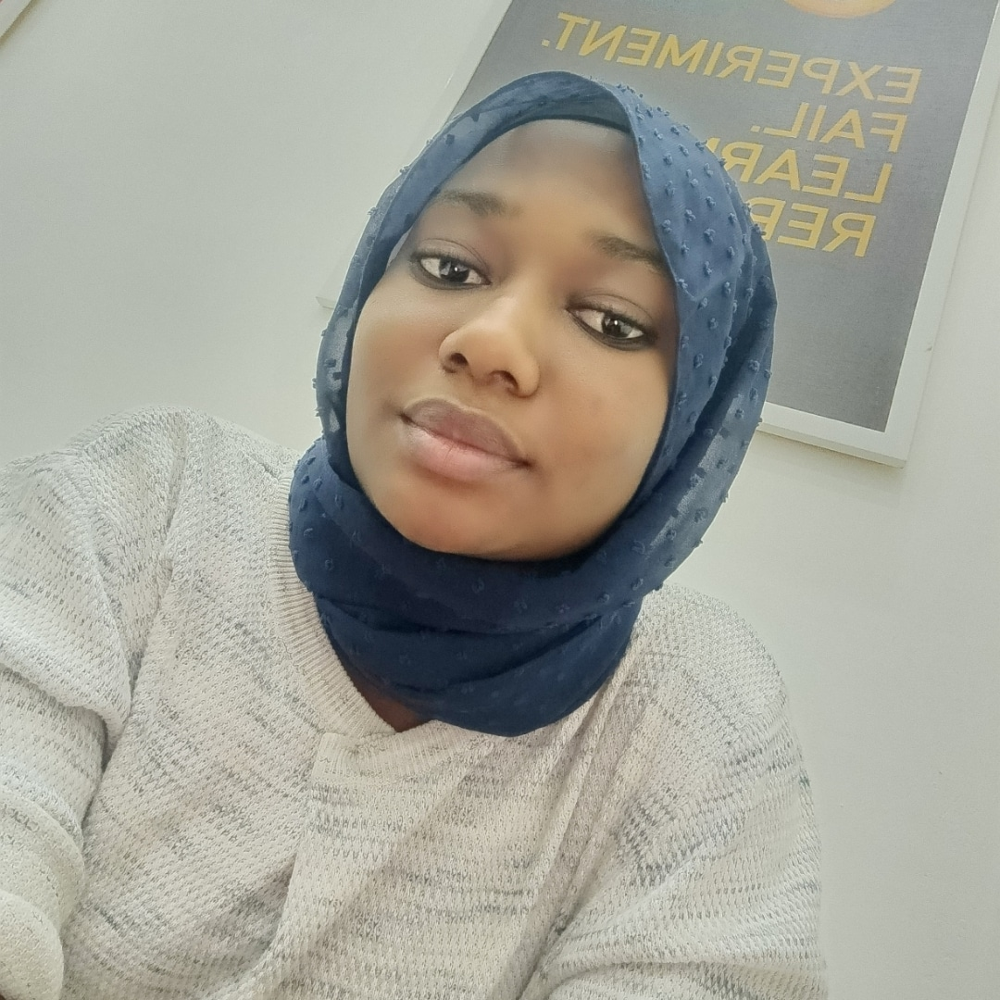

### Hi there 👋, I'm Fatima
#### Software Developer and Technical Writer

I am a software developer with 5+ years experience and I am extremely passionate about what I do as I enjoy bringing ideas to life and delivering seamless interactions that engage and delight users. The thing I love the most about what I do is the end product. I appreciate seeing people use applications that i built. I thrive on transforming design concepts into pixel-perfect, responsive websites and applications with HTML, CSS, JavaScript, or Typescript.

Over the years, I have had the opportunity to work in organizations and on projects that have challenged and helped me grow as well as equip myself with diverse skill sets, including expertise in modern frameworks such as React, Vue.js, and Node.js. I am constantly learning, exploring new technologies, and staying up-to-date with industry trends to ensure I can deliver cutting-edge solutions.

Beyond the code, I contribute to open source and create technical content as a form of service to the tech community. I am also a highly driven professional who possesses excellent communication and time management skills. As a result, I can work with little or no supervision, making me adaptable to any work environment. 

If you are looking to interact and discuss further more with me, please reach out to me via any of my social media accounts listed below. 
I look forward to meeting you.

#### Social Media:
        

<!--  -->

#### My major Skills: 
- Node.js 
- Typescript
- Vue.Js
- Next.JS
- React.JS 
- JavaScript 
- CSS
- HTML 
#### also,
- 🌱 I’m currently learning cloud

